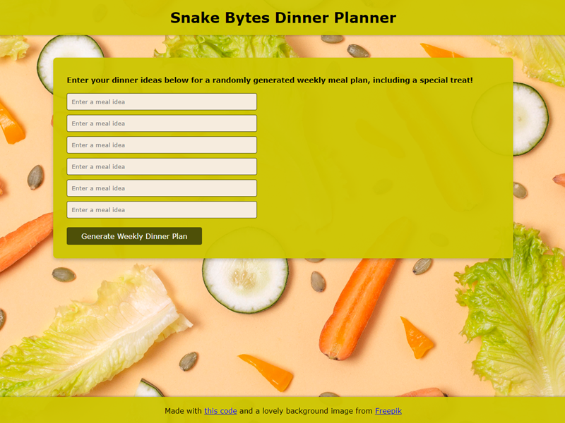
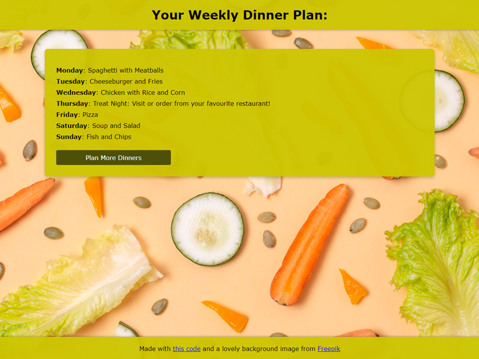
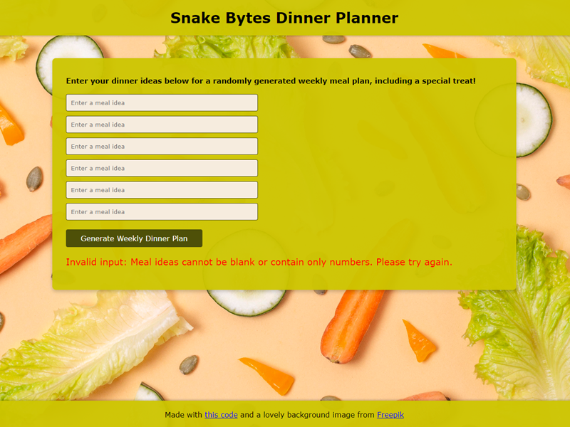

# Snake Bytes Dinner Planner

✨ [LIVE DEMO](https://kazvee.pythonanywhere.com/) ✨  

## Description

Snake Bytes Dinner Planner is a weekly meal planning app written in Python that uses the Flask framework. 

## Use Case

After buying groceries for the upcoming week, users can enter meal ideas based on the items they purchased, allowing the app to generate a personalized dinner plan. 🍽️

This helps eliminate the daily dilemma of deciding what to cook after a long day and ensures that the groceries are used efficiently, reducing food waste and spoilage. 🌍

The app shuffles the user's meal ideas and creates a weekly dinner plan. As an added bonus, it includes a randomly scheduled Treat Night — because who wants to cook _every single day_?! 😄

## Screenshots

### Main View

### Dinner Plan Results View

### Input Validation Example

## Getting Started

### Prerequisites
- Python 3.x
- Flask
- Virtual environment (optional but recommended)

### Installation

- Fork this repository to your own GitHub account.
- Clone your fork onto your local device.
- Create virtual environment with `python3 -m venv .venv`
- Activate virtual environment with `source .venv/bin/activate`
- Install required dependencies with `pip install -r requirements.txt`
- Start the Flask development server with `python app.py`
- Navigate to [http://127.0.0.1:5000](http://127.0.0.1:5000/) in your browser
- Create your weekly dinner plan! 🍽️